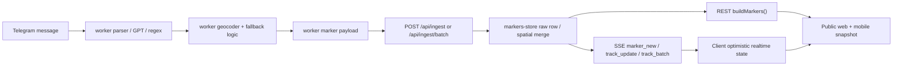
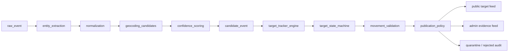

# Marker Pipeline Architecture Audit

Date: 2026-05-14

## Current Publication Entry Points

- `nextjs-app/worker/worker.py` parses Telegram messages, geocodes, builds marker payloads, and sends `/api/ingest`.
- `nextjs-app/src/app/api/ingest/route.ts` accepts single marker `POST`, partial marker `PATCH`, stores rows, and emits SSE.
- `nextjs-app/src/app/api/ingest/batch/route.ts` accepts retry queue batches, stores rows, and emits `markers_refresh`.
- `nextjs-app/src/lib/markers-store.ts` can emit `track_update`, `track_batch`, and `marker_delete` from internal merge/ticker/delete paths.
- `nextjs-app/src/lib/build-markers.ts` builds public REST snapshots for `/api/data`, `/api/threats`, admin stats, and SSR map data.
- `nextjs-app/src/lib/chat-sse-stream.ts`, `nextjs-app/src/server/realtime-ws-server.ts`, and `sse-gateway/main.go` relay marker events to clients.
- `nextjs-app/src/hooks/useMarkers.ts` applies realtime payloads optimistically before snapshot reconciliation.

## Current Pipeline

The unsafe architectural fact is `D`: the worker is still able to describe a map marker. The new design moves map authority to server-side tracked targets and publication policy.

## Target Pipeline

Raw events never render directly. They can only update or create tracked targets. Public rendering reads validated tracked objects.

## Findings

### P0: REST and SSE do not have a single immutable publication decision

Root cause: `buildMarkers()` uses `markerPassesPublicMapRawFilter()`, while ingest routes, store merge paths, batch refresh, ticker, and client direct-apply paths each use partial policy or no policy metadata.

Exploit scenario: a marker that would be filtered from `/api/data` can still be applied briefly via `track_update` or `track_batch`, then disappear on reconcile. On mobile this looks like phantom markers.

Production fix: create one deterministic `evaluateMarkerPublication()` decision and require every public REST/SSE path to use its result. SSE should only carry public payloads whose decision is `VERIFIED_PUBLIC`, or send a refresh/delete for downgrade.

Regression protection: invariant test that any marker rejected by REST policy cannot be emitted through `marker_new`, `marker_update`, `track_update`, or `track_batch`.

### P0: Worker can create public precision from fallback or ambiguous geography

Root cause: worker resolver and placement logic preserve coordinates for fallbacks (`oblast_fallback`, `estimated_*`, multi candidates) and old display policy treated those as approximate-but-still-visible pins.

Exploit scenario: message text like “над водою” or an ambiguous settlement name resolves to a land point or fallback center; the map renders a threat icon that looks like a real track.

Production fix: fallback, ambiguous, multi-match, synthetic, or guessed coordinates must be `ADMIN_ONLY` or lower. Public markers require explicit point locality confidence.

Regression protection: tests for `geocode_tier=multi`, `candidates_count>1`, `placement_mode=approximate`, `resolve_status=oblast_fallback`, and non-place labels.

### P0: Replay queue can refresh clients after non-public accepted rows

Root cause: `/api/ingest/batch` emits `markers_refresh` after any accepted raw row. Accepted raw rows can be admin-only or quarantined, but clients still refetch and may see transient state depending on cache/version timing.

Exploit scenario: old retry queue drains stale or low-confidence events; clients receive refresh bursts and reconcile against inconsistent worker-local Redis versions.

Production fix: batch response must classify each row and only broadcast when at least one row changes the public marker set or when public version changes.

Regression protection: replay test with rejected/admin-only rows must not emit public realtime changes.

### P0: Ticker mutates coordinates and broadcasts without publication re-evaluation

Root cause: `startPositionTicker()` changes `lat/lng`, sets `track_state=extrapolated`, persists, and emits `track_batch` with minimal deltas. The hot path does not attach publication decision or remove markers that degrade.

Exploit scenario: a previously public marker becomes stale/extrapolated or moves into impossible state; client keeps moving it until periodic snapshot catches up.

Production fix: ticker must either emit only public-safe deltas with policy metadata or emit a public refresh/delete when a marker leaves public eligibility.

Regression protection: chaos realtime test where a marker crosses from public to non-public during ticker updates.

### P1: Hidden/delete is best-effort and coordinate/text based

Root cause: hidden list uses `lat,lng|text|source`, while marker identity can change by track, merge, or ticker. It is not a first-class suppression decision in the raw event model.

Exploit scenario: operator deletes a marker, but a replayed event with a new id or shifted coordinate recreates it.

Production fix: suppression should be based on event fingerprint and normalized evidence fingerprint, not only display coordinates.

Regression protection: replay same raw event after delete must stay non-public.

### P1: Store merges unrelated evidence before policy classification

Root cause: spatial correlator merges by type, distance, loose place fingerprints, and bearing, then copies light fields (`place`, `resolve_status`, `placement_mode`) even when position is held/rejected.

Exploit scenario: bad geocode update cannot move the position, but can overwrite the public label to garbage or downgrade/upgrade semantics inconsistently.

Production fix: classify and score incoming evidence before merge. Rejected evidence may be retained in `rejected_observations`, but cannot overwrite public display fields.

Regression protection: impossible movement and bad-label merge tests.

### P1: Raw mobile messages bypass publication policy

Root cause: `/api/messages` reads `getRawMessages()` and returns recent raw marker rows directly.

Exploit scenario: a quarantined or rejected row can appear in mobile UI even if absent from public map.

Production fix: expose separate `admin evidence feed` vs `public messages feed`; public mobile endpoints must use publication policy.

Regression protection: endpoint contract test for raw-only rejected rows.

### P1: Admin/manual paths bypass confidence metadata

Root cause: manual marker add/update can create public markers without confidence/evidence trace. Manual override is intentional, but currently lacks auditable operator evidence.

Exploit scenario: an accidental admin click creates a marker indistinguishable from verified data to downstream clients.

Production fix: manual markers must be `MANUAL_PUBLIC` with operator metadata, timestamp, and audit reason, separate from `VERIFIED_PUBLIC`.

Regression protection: manual marker requires audit fields before public routing.

### P2: Confidence is overloaded

Root cause: `confidence`, `confidence_0_100`, `track_confidence`, parser confidence, geocode confidence, and display confidence are mixed.

Exploit scenario: high parser confidence can make low locality confidence look public.

Production fix: split scores into `extraction_confidence`, `locality_confidence`, `motion_confidence`, `source_confidence`, and final `publication_confidence`.

Regression protection: tests where one dimension is high and locality is low must route admin-only/quarantine.

## Required Invariants

- Unverified markers never become public.
- REST and SSE use the same publication decision.
- One raw event cannot create unrelated public markers.
- Fallback coordinates are never public.
- Ambiguous or multi-match geocoding is never public.
- Synthetic markers are never public unless explicitly manually audited.
- Public markers require `locality_confidence >= 0.95`.
- Public markers must have stable event or evidence fingerprint.
- Ticker/extrapolation cannot promote a non-public marker.
- Replay of the same raw event is idempotent.
- Stale events cannot move a public marker.
- Impossible movement cannot overwrite public position or public label.
- Rejected evidence is retained for audit but never used for display coordinates.

## Target Pipeline

`raw_event -> entity_extraction -> normalization -> geocoding_candidates -> confidence_scoring -> validation -> classification -> publication_policy -> public/admin routing`

Classification thresholds:

- `VERIFIED_PUBLIC`: `publication_confidence >= 0.95` and all invariants pass.
- `ADMIN_ONLY`: `publication_confidence >= 0.70` but not public-safe.
- `QUARANTINED`: `publication_confidence >= 0.40` or malformed but useful for audit.
- `REJECTED`: below `0.40` or violates hard safety invariants.
