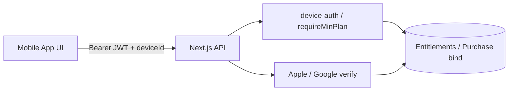

# NEPTUN Security Audit & Hardening

Last updated: 2026-05-23

Defensive security pass across **nextjs-app** (API) and **neptun_expo_app** (Expo client).

---

## 1. Executive summary

The backend had strong admin/ingest foundations but **critical gaps** in feedback IDOR, deviceId-only PRO authorization, IAP receipt sharing, weak chat moderator auth, and unauthenticated push registration. The mobile client treated PRO/reward state as locally trusted in several places.

This pass implements **server-side enforcement first**, with mobile changes to send device JWTs on sensitive routes and remove client-only monetization bypasses.

---

## 2. Critical findings (before)

| Severity | Issue | Location |
|----------|-------|----------|
| **Critical** | `GET /api/feedback` returned all tickets without auth | `api/feedback/route.ts` |
| **Critical** | `GET /api/feedback/[id]` open IDOR | `api/feedback/[id]/route.ts` |
| **Critical** | PRO/v1 APIs authorized by `deviceId` query only | `/api/v1/*` |
| **High** | One IAP receipt bindable to unlimited devices | `verify-purchase.ts` |
| **High** | `POST /api/register-device` allowed push token hijack | `register-device/route.ts` |
| **High** | Chat ban-list/unban via guessable moderator deviceId | `chat/ban-list`, `chat/unban` |
| **High** | Rewarded ad UI granted benefits without ad verification | `RewardedAdOffers.tsx` |
| **Medium** | JWT duplicated in AsyncStorage | `authService.ts` |
| **Medium** | Chat `isPro` from client form | `upload-image`, `upload-audio` |
| **Medium** | Legacy `/api/premium/entitlement` deviceId-only | `premium/entitlement/route.ts` |
| **Medium** | Legacy `/api/verify-purchase` open receipt probing | `verify-purchase/route.ts` |
| **Medium** | Feedback read/respond without JWT | `feedback/[id]/read`, `respond` |
| **Medium** | Chat nickname hijack (no JWT) | `chat/register-nickname` |
| **Medium** | Open ban enumeration | `chat/check-ban` |
| **Medium** | Chat reports without rate limit/schema | `chat/report` |
| **Medium** | Presence POST spam | `presence/route.ts` |

---

## 3. Implemented changes

### Backend (`nextjs-app`)

| Component | Purpose |
|-----------|---------|
| `src/lib/device-auth.ts` | JWT must match `deviceId` on sensitive routes (production default) |
| `src/lib/security-log.ts` | Structured security events without secrets/tokens |
| `src/lib/purchase-binding.ts` | One receipt → one device binding in Redis |
| `src/lib/moderator-auth.ts` | Admin session **or** JWT + registered moderator device |
| `src/lib/monetization/require-entitlement.ts` | `requireAuthenticatedDevice`, `requireMinPlan(request, …)` |
| `src/lib/api-schemas.ts` | Zod schemas for feedback, device, chat report, nickname, presence |
| `api/feedback/[id]/read`, `respond` | JWT owner match; admin respond requires session |
| `api/verify-purchase`, `api/premium/entitlement` | JWT + rate limits (legacy paths) |
| `api/chat/register-nickname` | JWT + rate limit (10/h/IP) |
| `api/chat/check-ban` | JWT only (no enumeration); rate limit |
| `api/chat/report` | Zod + rate limit (8/h/device+IP) |
| `api/presence` POST | Zod + rate limit (120/min/IP) |
| `api/v1/purchases/restore` | JWT + rate limit (20/h/IP) |
| Removed duplicate route | `admin/feed/ingest 2/route.ts` |
| `api/register-device` | JWT + rate limit (30/h/IP) |
| `api/auth/refresh` | Rate limit (20/h/IP) |
| `api/v1/users/bootstrap` | Device JWT required |
| `api/v1/reports/*` | Device JWT + plan checks |
| `api/v1/me`, `subscriptions/status` | Device JWT required |
| `api/v1/regions/*/stats` | Device JWT + PRO plan |
| `api/v1/alerts/[id]` | Device JWT + history window |
| `api/v1/purchases/*` | Device JWT + rate limit (30/h/IP) |
| `api/chat/ban-user` | `requireModeratorAuth` (JWT or admin) |
| `api/chat/upload-*` | `isPro` from server entitlements, not form |
| `verify-purchase.ts` | Purchase token / original transaction dedup |

### Mobile (`neptun_expo_app`)

| File | Change |
|------|--------|
| `monetizationApi.ts` | Sends Bearer JWT on all v1 PRO API calls |
| `entitlementsService.ts` | JWT on bootstrap/sync |
| `notificationService.ts` | JWT on all `register-device` calls |
| `purchaseService.ts` | JWT on purchase verify; restore always verifies server-side |
| `useModeratorScreenGuard.ts` | Redirect non-moderators from mod screens |
| `authService.ts` | Removed JWT copy in AsyncStorage |
| `chatService.ts` | JWT on nickname/ban/typing; removed `isPro` form field; mod-only ban list |
| `WebEmbedScreen.tsx` | HTTPS allowlist (`neptun.in.ua` only) |
| `ChatAdminScreen.tsx` | Moderator route guard |
| `ProfileAccountCard.tsx` | Device ID masked in UI |
| `ChatConversationScreen.tsx` | No client `isPro` on media upload |
| `RewardedAdOffers.tsx` | Removed client-only timer unlock; PRO upsell only |

### Tests

- `src/lib/__tests__/security-hardening.test.ts` — device JWT policy regression guard

---

## 4. Rate limits added / existing

| Route | Limit | Fail mode |
|-------|-------|-----------|
| `POST /api/feedback` | 8/h/IP | closed |
| `POST /api/register-device` | 30/h/IP | closed |
| `POST /api/auth/refresh` | 20/h/IP | closed |
| `POST /api/v1/purchases/restore` | 20/h/IP | closed |
| `POST /api/verify-purchase` | 20/h/IP | closed |
| `POST /api/premium/entitlement` | 20/h/IP | closed |
| `POST /api/chat/register-nickname` | 10/h/IP | closed |
| `POST /api/chat/report` | 8/h/device+IP | closed |
| `POST /api/chat/check-ban` | 120/h/IP | closed |
| `POST /api/presence` | 120/min/IP | closed |
| `POST /api/auth/token` | 10/min/IP | closed (existing) |
| Chat send | IP + device (existing) | Redis |

Nginx: see `deploy/nginx-http-limits-snippet.conf` for edge limits.

---

## 5. Environment variables

| Variable | Purpose |
|----------|---------|
| `REQUIRE_DEVICE_JWT` | `false` disables JWT binding (dev only). Default: **on in production** |
| `JWT_SECRET` / `AUTH_SECRET` | Chat + device JWT signing (**must be stable in prod**) |
| `ADMIN_API_SECRET` | Admin/moderator header (separate from ingest) |
| `INGEST_SECRET` | Worker ingest only |

---

## 6. Remaining risks / TODO

1. **Moderator secret in WebView** — `window.__ADMIN_SECRET` injection; migrate to server-side embed session.
2. **SSE JWT in query string** — prefer short-lived SSE ticket POST exchange.
3. **In-memory chat rate limiters** — move to Redis for multi-worker deploys.
4. **Shadowban** — not implemented; design needed with legal review.
5. **2FA for admin web** — optional future work.
6. **Firebase App Check** — restrict mobile API keys.
7. **Cap on `register-device` per deviceId** — dedupe token churn abuse.
8. **Rewarded ads** — wire AdMob rewarded + server-side grant endpoint before re-enabling UI unlocks.
9. **Client PRO UI gates** — align `ProFeatureGate` with server entitlements cache, not MMKV-only `isPremium`.
10. **SecureStore fallback** — fail closed for moderator secret / JWT when SecureStore unavailable.
11. **WebSocket server** — `/ws/threats`, `/ws/social` unauthenticated (port 4001).

---

## 7. Verification checklist

- [ ] Non-admin `GET /api/feedback` without `device_id` → **401**
- [ ] Non-owner `GET /api/feedback/[id]` → **401/403**
- [ ] v1 PRO route with foreign `deviceId` + no JWT → **401**
- [ ] v1 PRO route with JWT mismatch → **403**
- [ ] Second device binding same purchase token → **rejected**
- [ ] `POST /api/register-device` without JWT (prod) → **401**
- [ ] Chat ban-list without mod JWT/admin → **403**
- [ ] Rewarded UI no longer grants local PRO/history unlock
- [ ] Push tokens not shown in production profile UI (`DeveloperDiagnosticsSection` is `__DEV__` only)

---

## 8. Architecture trust boundary

**Rule:** Client gates are UX only. Paid features, push registration, feedback moderation, and PRO data require server validation.
