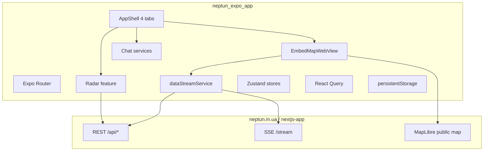

# NEPTUN — Flutter → React Native Migration Architecture

**Principle:** Engine migration, not redesign. Production map = **WebView embed** of `neptun.in.ua/?embed=1` (MapLibre runs on the web stack). Native MapLibre (`@rnmapbox/maps`) is an **optional** dev/alternate engine only.

---

## 1. System overview



| Layer | Technology | Flutter equivalent |
|-------|------------|-------------------|
| UI | React Native + Reanimated + Gesture Handler | Widgets + implicit animations |
| Navigation | Expo Router file routes | GoRouter |
| Client state | Zustand (feature stores) | Riverpod |
| Server state | React Query (cache, retry) | FutureProvider + manual cache |
| Realtime | Single SSE multiplex | `DataStreamService` |
| Storage | MMKV + SecureStore + AsyncStorage hydrate | SharedPreferences + secure_storage |
| Map (prod) | WebView + JS bridge | `map_tab.dart` |
| Map (alt) | @rnmapbox/maps shape layers | `native_map_page.dart` (legacy) |
| OTA | EAS Update + `expo-updates` | — |
| Push | expo-notifications + FCM (Phase 4) | `notification_service.dart` |

---

## 2. Target file tree

```
neptun_expo_app/
├── app/                          # Expo Router (screens = thin re-exports)
│   ├── _layout.tsx               # fonts, gate, QueryClient, dev client
│   └── (tabs)/                   # Map, Radar, Chat, Profile
├── src/
│   ├── core/
│   │   ├── navigation/           # routePaths, pushDeepLink, appRedirect
│   │   ├── pro/                  # proGate
│   │   └── di/                   # (future) service registry
│   ├── config/                   # api, constants, prefsKeys, remoteConfig
│   ├── components/               # design system (Neptun*)
│   ├── features/
│   │   ├── map/
│   │   │   ├── components/       # EmbedMapWebView, sheets, strip
│   │   │   ├── engine/           # markerMotionEngine, applyMarkerPatch
│   │   │   ├── hooks/            # useLiveMapData
│   │   │   ├── services/         # mapDataService
│   │   │   ├── state/            # mapStore
│   │   │   └── utils/
│   │   ├── radar/                # repository, feed, track meta
│   │   ├── chat/                 # (Phase 3) controller, bubbles
│   │   ├── notifications/        # (Phase 4) prefs, channels
│   │   └── premium/              # (Phase 4) IAP, paywall
│   ├── hooks/                    # cross-feature hooks
│   ├── services/                 # apiClient, auth, SSE, platform
│   ├── screens/                  # compose features → routes (transitional)
│   ├── theme/
│   └── types/
├── assets/geo/                   # oblast/district GeoJSON
├── assets/icons/                 # threat symbols
├── eas.json
├── MIGRATION.md                  # parity matrix
└── MIGRATION_ROADMAP.md          # phased delivery
```

---

## 3. Map engine strategy (critical)

### Production path (must match Flutter)

| Concern | Implementation |
|---------|----------------|
| Rendering | `EmbedMapWebView` → `https://neptun.in.ua/?embed=1&theme=dark` |
| Marker motion | **Server + Next.js** (`markers-store.ts`, `track_update` SSE) — not duplicated in RN |
| Tap → sheet | JS bridge `threat_marker_tap` → `MapThreatMarkerSheet` |
| HUD | `MapSituationStatusStrip` (link phase, last refresh) |
| Moderator | `moderatorService` embed bootstrap |
| WKWebView fix | `mapWebViewInject.ts` resize/recover kicks |

### Optional native path (`EXPO_PUBLIC_MAP_ENGINE=native`)

| Concern | Implementation |
|---------|----------------|
| Rendering | `@rnmapbox/maps` shape sources (no per-marker Views) |
| Motion | `markerMotionEngine.ts` — interpolate `track_update` at capped Hz |
| Polygons | Wire `assets/geo/*.geojson` (Phase 2) |
| Icons | Symbol layers + `assets/icons/` (Phase 2) |

**Do not use Mapbox SaaS tokens for product identity** — MapLibre + self-hosted/raster tiles only.

---

## 4. Realtime contract (SSE)

Mirror `data_stream_service.dart` event types:

| Event | Store action |
|-------|----------------|
| `alarm_update` | `setAlarmData` |
| `marker_new` | `upsertMarker` or full refresh |
| `marker_update` | `applyMarkerPatch` |
| `track_update` | `patchTrack` + motion engine (native map) |
| `markers_refresh` | refetch markers |
| `marker_delete` | `deleteMarker` |

**Performance:** batch `track_update` to ≤20 Hz on JS thread; significant HUD refresh excludes high-frequency track events (Flutter parity).

---

## 5. Module migration matrix

| Flutter module | RN module | Status |
|----------------|-----------|--------|
| `map_tab.dart` | `EmbedMapWebView` + `MapScreen` | ✅ |
| `map_situation_status_strip` | `MapSituationStatusStrip` | ✅ |
| `map_threat_marker_sheet` | `MapThreatMarkerSheet` | ✅ |
| `native_map_page` + `map_layers` | `TacticalMap` + motion engine | 🟡 |
| `radar_repository` + feed widgets | `src/features/radar/*` | 🟡 this slice |
| `chat_tab` + `features/chat` | `ChatScreen` + services | 🟡 ~80% |
| `notification_service` (3135 LOC) | `notificationService` | 🔴 skeleton |
| `purchase_service` | — | 🔴 |
| `app_shell` | `AppShellChrome` + tabs | 🟡 |
| `onboarding_page` | `OnboardingScreen` | 🔴 minimal |
| Widgets / Live Activity | — | 🔴 |

---

## 6. Performance requirements

| Target | Approach |
|--------|----------|
| 60fps map | WebView: Next.js MapLibre; Native: GPU shape layers only |
| 1000+ markers | Clustering + viewport cull; never map markers to `<View>` |
| Low memory | Zustand selectors; `React.memo` on feed tiles; virtualize lists |
| Battery | SSE reconnect on AppState; throttle motion interpolation |
| Fast start | MMKV sync reads; lazy route screens; font preload in root layout |

---

## 7. OTA & remote configuration

| Mechanism | Purpose |
|-----------|---------|
| EAS Update channels | JS/asset hotfix without store rebuild |
| `GET /api/app-requirements` | Min version gate (implemented) |
| `expo-updates` | Check on load |
| Future: feature flags JSON | Toggle radar filters, map engine, ads |
| Future: remote map style URL | MapLibre style hot-swap (native path) |

**Cannot OTA:** native module changes (`@rnmapbox`, `react-native-mmkv`, WebView config) → require `eas build`.

---

## 8. Dev workflow

```bash
cd neptun_expo_app
npm install
npm start                    # expo start --dev-client (Metro required)
npx expo run:ios --device    # real device — NOT Expo Go
```

Expo Go is **unsupported** (custom native modules). Use **development build** + Metro.

---

## 9. Quality gates

- `npm run typecheck` — strict TypeScript
- `npm run test:navigation` — deep link parity
- `npm run test:radar` — repository normalization
- Manual: SSE reconnect, embed map tap sheet, radar filters, 500+ marker poll

**Rule:** No placeholder business logic in a “done” phase.

---

## 10. Current phase

**Phase 2 — Realtime & map engine** (in progress)  
**Next:** Phase 3 tab UI clone (radar feed parity, chat settings, profile prefs)

See `MIGRATION_ROADMAP.md` for checklist.
